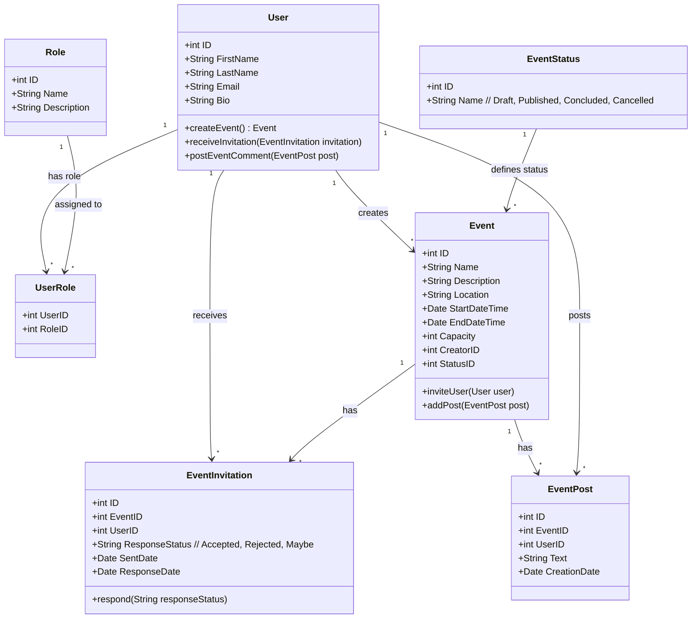

## Documentación del Proyecto: Aplicación de Gestión de Eventos Sociales

---

### 1. Introducción
La aplicación de gestión de eventos sociales es una herramienta diseñada para ciudadanos y turistas que desean tener acceso centralizado a los eventos sociales de una ciudad o región. A través de esta app, los usuarios podrán registrarse, explorar eventos, recibir invitaciones y unirse a aquellos eventos de su interés. Además, permitirá a organizadores (hosts) crear, gestionar y compartir eventos con una audiencia específica, proporcionando una plataforma interactiva y fácil de usar para la gestión de actividades sociales.

### 2. Justificación
En muchas ciudades y destinos turísticos, la información sobre eventos suele estar dispersa en múltiples plataformas, lo que dificulta su acceso y seguimiento. Esta aplicación busca resolver este problema al centralizar toda la información relevante en un solo lugar, ofreciendo una experiencia intuitiva tanto para los organizadores de eventos como para los asistentes. La app beneficiará a los usuarios al permitirles descubrir fácilmente actividades locales, y a los organizadores al ofrecerles un medio efectivo para promocionar sus eventos y gestionar la participación.

### 3. Objetivo General del Proyecto
Desarrollar una aplicación móvil que permita a usuarios y organizadores de eventos gestionar actividades sociales en una plataforma centralizada, ofreciendo funcionalidades que faciliten la creación, visualización, administración y participación en eventos.

### 4. Objetivos Específicos del Proyecto
- Crear una plataforma intuitiva y accesible que permita a los usuarios ver y registrarse en eventos de su interés.
- Facilitar a los organizadores (hosts) la creación y gestión de eventos, incluyendo opciones de invitación y comunicación con los asistentes.
- Implementar un sistema de roles para diferenciar permisos y funcionalidades entre usuarios regulares, hosts y administradores.
- Garantizar que la aplicación sea segura y confiable para la protección de la información de los usuarios.
- Diseñar una arquitectura de sistema modular y escalable para posibles futuras ampliaciones de la aplicación.

### 5. Objetivo General del Sistema
El objetivo general del sistema es proporcionar una plataforma de eventos sociales que centralice toda la información de actividades en una interfaz de fácil navegación, optimizada para dispositivos móviles, y que soporte las necesidades de los usuarios y organizadores de eventos de manera eficiente y segura.

### 6. Límite
La aplicación está pensada para funcionar principalmente en un entorno local o regional, promoviendo eventos en una ciudad o zona específica. La app estará orientada a dispositivos Android en su primera fase de desarrollo. La administración y los servicios de backend serán gestionados por un servidor central, con acceso mediante una API segura que soporte la funcionalidad de la app.

### 7. Alcance
- **Usuarios** podrán registrarse, iniciar sesión, editar su perfil, ver y unirse a eventos, recibir y responder invitaciones, y ver publicaciones de eventos.
- **Organizadores (Hosts)** podrán crear, editar y cancelar eventos, enviar invitaciones, y gestionar publicaciones dentro de los eventos.
- **Administradores** tendrán acceso a la asignación de roles y la moderación general de los eventos, pudiendo también administrar la lista de usuarios.
- La aplicación será diseñada para uso en dispositivos Android, con un backend desarrollado en .NET para gestionar la lógica de negocios y la persistencia de datos.

### 8. No Contemplado
- La app no incluirá un sistema de pago integrado para eventos de pago. 
- No se contemplan funcionalidades de redes sociales avanzadas como la mensajería directa entre usuarios o feeds de noticias.
- No se implementará inicialmente una versión para iOS o una versión web de la aplicación.
- No se incluyen opciones de búsqueda avanzada por categorías de eventos o filtros complejos en la primera versión.

### 9. Tecnologías
- **Frontend**: Aplicación Android desarrollada en Java/Kotlin, usando ViewModel y LiveData para la arquitectura de la interfaz.
- **Backend**: API RESTful desarrollada en .NET (ASP.NET Core), utilizando Entity Framework para la gestión de datos.
- **Base de Datos**: SQL Server o MySQL para la persistencia de datos en el servidor.
- **Librerías adicionales**:
  - **Retrofit** para llamadas HTTP en Android.
  - **Glide** para la carga de imágenes.
  - **JWT** para autenticación de usuarios y autorización segura de la API.

### 10. Competencia
Existen aplicaciones como Eventbrite o Meetup que ofrecen plataformas globales para la gestión de eventos. Sin embargo, la propuesta de esta app se centra en un enfoque local, permitiendo a los usuarios descubrir y participar en eventos de una ciudad o región específica, con funcionalidades de invitación y administración simplificadas. Este enfoque específico permite una mayor adaptación a las necesidades de un contexto local o turístico.

### 11. Listado de Requerimientos Funcionales

1. **RF-1**: El sistema debe permitir el registro de usuarios con roles específicos (usuario, organizador, administrador).
2. **RF-2**: El usuario debe poder iniciar sesión y cerrar sesión de forma segura.
3. **RF-3**: Los usuarios deben poder ver la lista de eventos disponibles y unirse a eventos públicos o privados mediante invitación.
4. **RF-4**: Los organizadores deben poder crear, editar y cancelar eventos.
5. **RF-5**: Los organizadores deben poder enviar invitaciones a usuarios específicos.
6. **RF-6**: El usuario debe poder responder a las invitaciones (aceptar, rechazar o indicar interés).
7. **RF-7**: La aplicación debe permitir a los usuarios ver y editar su perfil.
8. **RF-8**: Los usuarios deben poder crear y visualizar publicaciones dentro de un evento.
9. **RF-9**: El sistema debe permitir la asignación de roles y permisos según el tipo de usuario.
10. **RF-10**: Los administradores deben poder asignar roles a los usuarios.

### 12. Listado de Requerimientos No Funcionales

1. **RNF-1**: La aplicación debe tener una interfaz de usuario intuitiva y responsiva, adaptada para dispositivos Android.
2. **RNF-2**: La API debe utilizar tokens JWT para garantizar la autenticación y autorización segura de los usuarios.
3. **RNF-3**: La aplicación debe responder rápidamente a las acciones del usuario, con un tiempo de carga de eventos inferior a 2 segundos en condiciones de red normales.
4. **RNF-4**: La aplicación debe ser escalable, permitiendo la futura expansión a nuevos tipos de eventos y funcionalidades sin reestructuración significativa.
5. **RNF-5**: Los datos personales de los usuarios, incluidas las contraseñas, deben almacenarse de manera segura y cumplir con los estándares de protección de datos.
6. **RNF-6**: La aplicación debe funcionar en dispositivos Android con versiones desde Android 8 (Oreo) en adelante.
7. **RNF-7**: La documentación del código y las interfaces de la API deben estar actualizadas y disponibles para facilitar el mantenimiento.
8. **RNF-8**: El backend debe tener una tasa de disponibilidad de al menos el 99.5% para garantizar el acceso continuo a los servicios.

### 13. Desarrollo del Prototipo

* #### Análisis y Diseño
> UNDER CONSTRUCTION :P

* #### Diagrama de Casos de Uso más relevantes

    Vamos a dividir los casos de uso en tres grupos para claridad:

1. **Casos de uso relacionados con la gestión de usuarios**.
2. **Casos de uso relacionados con la gestión de eventos**.
3. **Casos de uso relacionados con las invitaciones y publicaciones**.
    ##### 1. Casos de Uso: Gestión de Usuarios
    
    ##### 2. Casos de Uso: Gestión de Eventos
    
    ##### 3. Casos de Uso: Invitaciones y Publicaciones
    

* #### Diagrama de Clases

* #### Interfaz Gráfica
>UNDER CONSTRUCTION 😂